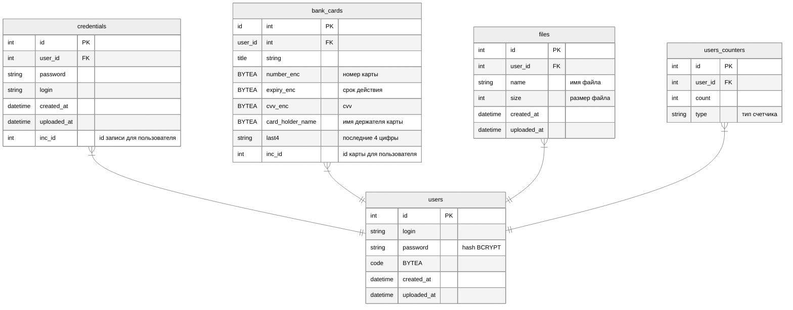

# Схема БД

```mermaid
---
config:
  theme: neutral
---
erDiagram
	direction TB
	credentials {
		int id PK ""  
        int user_id FK ""  
		string password  ""  
        string login  ""  
		datetime created_at  ""  
		datetime uploaded_at  ""
        int inc_id    "id записи для пользователя"  
	}
	users {
		int id PK ""  
		string login  ""  
		string password  "hash BCRYPT"  
        code BYTEA  ""  
		datetime created_at  ""  
		datetime uploaded_at  ""  
	}
    users_counters {
		int id PK ""  
        int user_id FK ""  
        int count ""
        string type  "тип счетчика" 
	}
    bank_cards {
        id int  PK ""  
        user_id int FK ""  
        title string  ""
        BYTEA number_enc   "номер карты"  
        BYTEA expiry_enc  "срок действия"
        BYTEA cvv_enc  "cvv"
        BYTEA card_holder_name   "имя держателя карты"
        string last4   "последние 4 цифры"
        int inc_id    "id карты для пользователя"
    }
    files {
        int id PK ""
        int user_id FK ""
        string name "имя файла"
        int size "размер файла"
        datetime created_at  ""  
		datetime uploaded_at  ""  
    }
	credentials}|--||users:"  "
    bank_cards}|--||users:"  "
    files}|--||users:"  "
    users_counters}|--||users:"  "

```