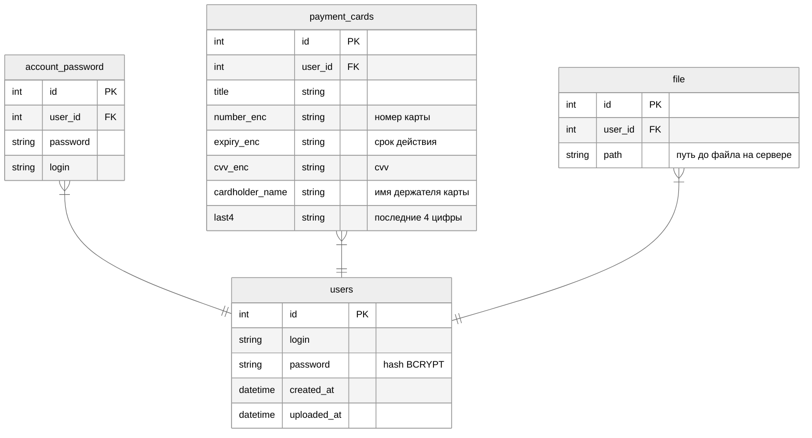

# Схема БД

```mermaid
---
config:
  theme: neutral
---
erDiagram
	direction TB
	account_password {
		int id PK ""  
                int user_id FK ""  
		string password  ""  
        string login  ""  

	}
	users {
		int id PK ""  
		string login  ""  
		string password  "hash BCRYPT"  
		datetime created_at  ""  
		datetime uploaded_at  ""  
	}
    payment_cards {
        int id PK ""  
        int user_id FK ""  
        title string  ""
        number_enc string  "номер карты"  
        expiry_enc string  "срок действия"
        cvv_enc string  "cvv"
        cardholder_name string  "имя держателя карты"
        last4 string  "последние 4 цифры"
    }
    file {
        int id PK ""
        int user_id FK ""
        string path "путь до файла на сервере"
    }
	account_password}|--||users:"  "
    payment_cards}|--||users:"  "
    file}|--||users:"  "

```