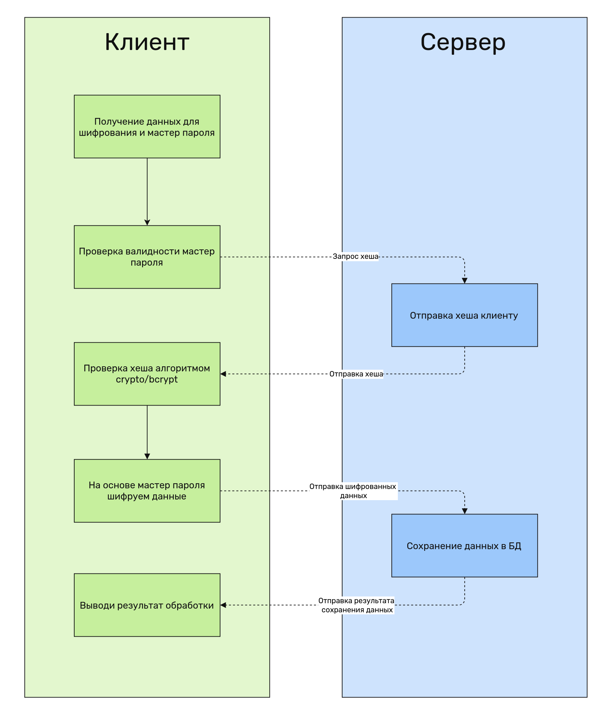

# Описание процесса шифрования данных

Шифрование данных происходит на основе "Мастер пароля".   
Сервер выступает в качестве хранилища уже зашифрованных данных.   
Все данные шифруются перед отправкой на клиенте, в качестве ключа используется мастер пароль.

Во время регистрации пользователя он должен указать мастер пароль, который не подлежит восстановлению. Если пользователь забудет мастер пароль, то данные будут безвозвратно утеряны. Данный мастер пароль хешируется на клиенте и отправляется на сервер.

Перед шифрованием любых данных, происходит проверка мастер ключа. На сервер отправляется запрос для получение хеша ключа. Проверка валидности ключа происходит на стороне клиента, при помощи алгоритма bcrypt.

Если мастер пароль верный, то уже приступаем к шифрованию данных на клиенте. После этого происходит отправка зашифрованных данных на сервер.

Дешифрование происходит в обратном порядке.
Отправляется запрос на сервер для получения всех данных. Сервер возвращает зашифрованные данные. На основе мастер пароля происходит дешифровка на стороне клиента.

Схема работы

